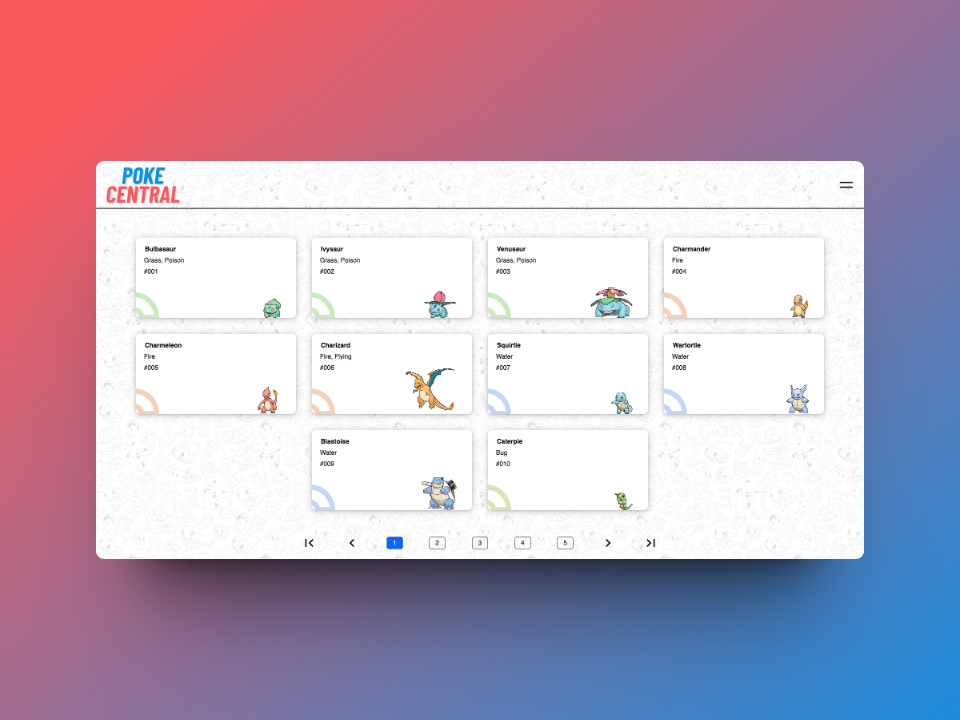

# PokeCentral: Your Ultimate Pokédex Companion

PokeCentral is your ultimate Pokédex companion, providing a comprehensive database of Pokémon species along with detailed information and interactive features. Whether you're a seasoned trainer or just starting your journey, PokeCentral has everything you need to explore the world of Pokémon and become a master trainer.

## Features:
- **Complete Pokédex:** Access a vast collection of Pokémon species, including types, abilities, evolutions, and stats.
- **Efficient Search:** Easily find specific Pokémon by name or type using the intuitive search functionality.
- **Battle Simulation** Try out the battle simulation with your best Pokémon!
- **Detailed Profiles:** Dive deep into detailed profiles for each Pokémon, featuring descriptions, height, weight, and base stats.
- **Interactive Images:** View high-quality images and sprites of Pokémon for easy identification.
- **Type Matchup Chart:** Consult the type matchup chart for strategic insights during battles.
- **Favorites:** Keep track of your favorite Pokémon by marking them as favorites for quick access.
- **Evolution Chains:** Explore evolution chains for Pokémon species with multiple forms.
- **Ability Details:** Understand the abilities of each Pokémon and their effects in battles.
- **Berries Details:** Discover all the berries and their effects.
.

## How to Use:
1. **Browse Pokémon:** Explore the extensive collection of Pokémon available in the Pokédex.
2. **Search Pokémon:** Utilize the search feature to quickly locate specific Pokémon by name, type, or region.
3. **View Details:** Click or tap on a Pokémon to access its comprehensive profile, including descriptions and stats.

## Contribution:
Contributions to PokeCentral are highly appreciated! If you have suggestions for new features, improvements to existing features, or would like to report any issues, please feel free to contribute to our project. You can contribute by submitting pull requests on our GitHub repository or by providing feedback through our app's contact form. Your input helps us enhance the PokeCentral experience for all users.
